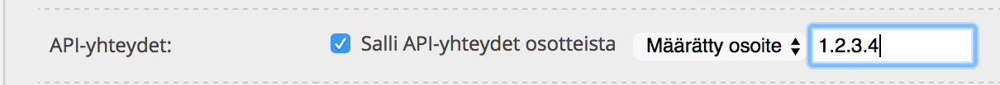
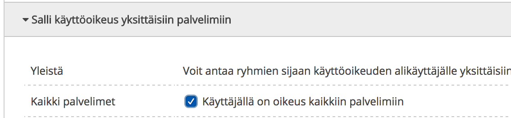

# Configuration

## Vagrant
We have a shared vagrantfile under WunderMachina and the project root Vagrantfile is just a wrapper that includes it, runs the build.sh. To configure project specific vagrant settings you can use conf/vagrant.local.yml. Currently supported variables are:
```
name : The name of the box
hostname : local hostname to be used. If you have vagrant-hostmanager installed this will be automatically added to your /etc/hosts
mem : Amount of memory in virtual machine
cpus : Number of cpus
ip : Box ip
box : Image to be used as base box
```


## Ansible
Ansible configurations are divided in three separate layers:
1. variables.yml for common configurations among environments
2. [environment].yml for environment specific configurations and overrides (e.g. vagrant.yml, production.yml)
3. [environment]-vars.yml for ansible-vault encoded environment specific variables

You can further divide environment specific config files by role. For example in multiserver environments you might want to have production.yml divided into prod-db.yml for database server, prod-lb.yml for loadbalancer and prod-front.yml for webfronts.

conf/server.inventory file is used for defining remote server addresses. Vagrant has it's own inventory file that is used automatically so no need to worry about that.

## Provisioning
Provisioning different environments is easy with the provided ```provision.sh``` script. To provision an environment you can simply run ```./provision.sh [environment]``` where environment must mach the main environment configuration file name. For example to provision production environment defined in conf/production.yml you can run ```./provision.sh production```.

Provision.sh supports multiple options and have a special case for when provisioning a new server for the first time.
Doing the initial provisioning on a server requires the use of root password and also setting up mysql root password. For this you need to use -f option for the "first run" and -m option to provide the mysql root password:
```./provision.sh -f -m you_mysql_root_pass production``` 

If you only have changes to some of the configurations you don't have to run the full provisioning every time. Instead you can use tags to only run the specified roles. For example to provision just the php-fpm role on production you can run:
```./provision.sh -t php-fpm production```
There is also the -s option for excluding certain tags from being ran:
```./provision.sh -s nginx,varnish production```

Provision.sh assumes you have ansible-vault encrypted variables and therefore requires you to provide the path to your vault-password-file. There are two options for providing this: 
1. you can define WT_ANSIBLE_VAULT_FILE environment variable running: 
```export WT_ANSIBLE_VAULT_FILE=/path/to/your/ansible-pass-file.txt``` 
or adding it to your ~/.bashrc or equivalent
2. Provide it to provision.sh with the -p option: 
```./provision.sh -p /path/to/your/ansible-pass-file.txt production```

All additional flags are passed to the ansible-playbook command. So you can use for example -C for check or -v for verbose output.

## Defaults and overrides
You can find all the default settings from under the ansible/playbook/roles/[rolename]/defaults/main.yml. Our default ansible.cfg defines hash_behaviour=merge so it is possible to only override part of the dictionary variables without the need to define it completely in your custom configurations.
For example varnish role defines the following dictionary for a default setup:
```
varnish:
  port: 8081
  memory: 1G
  probe_resource_url: "_ping.php"
  acl_internal:
    - ip: 127.0.0.1
  acl_purge:
    - ip: 127.0.0.1
  acl_upstream_proxy:
    - ip: 127.0.0.1
  directors:
    # One app
    - name: test_com_director
      host: test.com
      backends:
        - name: test1_web
          address: 127.0.0.1
          port: 8080
```
In your variables you can simply define:
```
varnish:
  directors:
    - name: yoursite_com_director
      host: yoursite.com
      backends:
        - name: yoursite_web
          address: 127.0.0.1
          port: 8080
```
and the rest will be merged from the defaults.

## Using WunderSecrets
You can use shared secret variables by providing a private repository into `conf/project.yml`. The repository needs to contain `ansible.yml` in the root folder. Variables from that file are added for `provision.sh` ansible run automatically.

** For example the default Wunder config: **
```yaml
wundersecrets:
  remote: git@github.com:wunderkraut/WunderSecrets.git
```

## Using UpCloud firewall
Wundertools contains role for setupping firewall rules using [UpCloud Firewall](https://www.upcloud.com/). This reduces load on the machines hosted in UpCloud. We prefer the firewall provided by UpCloud over `iptables` or `ufw` because it can be disabled even if we don't have access to the machines so it's more foolproof and we don't lock us out by accidental changes.

To use UpCloud firewall role you need to:
1. Set up WunderSecrets for the project to access our shared list of allowed IP addresses
2. Set up a sub-account for the UpCloud main user
  * Allow API access for the sub-account and remember to limit the access for the VPN IP address near your location. <br>
  * Allow user to modify all servers <br>
  * Ensure that 2FA is enabled for the user

3. You need to export your username and password for before running `provision.sh`:
```bash
export UPCLOUD_API_USER=your-username; UPCLOUD_API_PASSWD=your-password
```

To setup the sub-user you need to login with the main user:
1. Create the sub-account
2. Enable UpCloud API for the sub-account

And finally create a `firewall_web` group in your inventory file like this:
```
[loadbalancer]
10.0.0.1

[stage]
10.0.0.2

[firewall_web:children]
loadbalancer
stage
```

All servers which belong into this group will have their web ports 80/443 open.

### Configuration variables for the firewall
```
# This is a list of allowed IP addresses to SSH port.
# It is inherited from WunderSecrets by default
firewall_ssh_allowed:
  #- comment: Admin machine
  #  ip: 10.0.0.1
  #- comment: Test Machine
  #  ip: 10.0.0.2

# These IP addresses should be unique for certain project and they are added into `firewall_ssh_rules`
project_additional_ssh_firewall_rules:
  #- comment: Admin machine
  #  ip: 10.0.0.1
  #- comment: Test Machine
  #  ip: 10.0.0.2

# IP addresses from this list are ensured to be removed
remove_ssh_firewall_rules:
  #- comment: Admin machine
  #  ip: 10.0.0.1
  #- comment: Test Machine
  #  ip: 10.0.0.2

# This is list of custom rules for the project
# This feature can be used for example to allow DB access to additional servers
project_additional_firewall_rules:
  #- direction: in
  #  family: IPv4
  #  protocol: tcp
  #  source_address_start: 127.0.0.1
  #  source_address_end: 127.0.0.255
  #  destination_port_start: 22
  #  destination_port_end: 22
  #  action: accept
```

## Debugging tools

XDebug tools are installed via the devtools role. Everything should work out
of the box for PHPStorm. PHP script e.g. drush debugging should also work.

Example sublime text project configuration (via Project->Edit Project):

    {
       "folders":
       [
         {
           "follow_symlinks": true,
           "path": "/path/to/ansibleref"
         }
       ],

       "settings":
       {
         "xdebug": {
              "path_mapping": {
                    "/vagrant" : "/path/to/ansibleref"
                 }
            }
          }
    }

